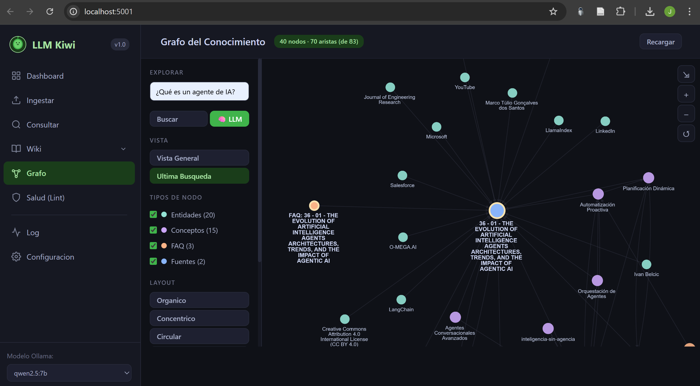

# LLM Wiki

LLM Wiki es una aplicación local para convertir una colección de PDFs sobre cualquier tema en una wiki Markdown consultable. El flujo principal ingesta documentos, crea páginas fuente, extrae conceptos y entidades, mantiene enlaces internos y expone una interfaz web en Flask.


## Relación con el patrón LLM Wiki de Karpathy

Esta aplicación implementa una versión concreta del patrón [LLM Wiki propuesto por Andrej Karpathy](https://gist.github.com/karpathy/442a6bf555914893e9891c11519de94f). La idea central de ese patrón es reemplazar el uso pasivo de RAG por una base de conocimiento persistente: en vez de recuperar fragmentos crudos en cada pregunta, el LLM compila conocimiento una vez, lo integra en Markdown, mantiene enlaces internos y permite que la síntesis se acumule con cada fuente y cada consulta.

La correspondencia principal es:

| Patrón LLM Wiki | Implementación en esta app |
| --- | --- |
| Fuentes crudas e inmutables | PDFs locales en `papers/` o `Documentos/`, excluidos de Git por defecto. |
| Wiki persistente | Archivos Markdown en `wiki/`, organizados en fuentes, conceptos, entidades, FAQ y páginas generales. |
| Schema de comportamiento | Reglas del mantenedor en `schema/AGENTS.md`, usadas para orientar ingesta, consulta y mantenimiento. |
| Operación de ingesta | `scripts/ingest.py` y la vista web de ingesta crean páginas fuente, conceptos, entidades, FAQ, índice y log. |
| Operación de consulta | `scripts/query.py` selecciona páginas relevantes y responde usando la wiki como capa compilada de conocimiento. |
| Operación de lint/mantenimiento | `scripts/lint.py` revisa enlaces rotos, páginas huérfanas, duplicados, estructura e índice. |
| Index y log | `wiki/index.md` funciona como catálogo navegable; `wiki/log.md` registra la evolución cronológica. |

La diferencia práctica frente al texto original de Karpathy es que aquí el patrón no queda como una guía abstracta para un agente en Obsidian o en un editor, sino como una aplicación local operativa: tiene interfaz web, CLI, integración con Ollama, subida y borrado de PDFs, configuración de dominio y controles de salud de la wiki. Esto convierte la idea de "wiki como artefacto acumulativo" en un flujo repetible para investigación documental sobre agentes de IA.

## Apreciación

LLM Wiki es valioso porque cambia el centro de gravedad del sistema: el conocimiento deja de vivir en respuestas efímeras de chat y pasa a vivir en archivos versionables, enlazados y auditables. Esta app aprovecha esa lógica y la aterriza en un entorno local, pragmático y controlable. No busca ser solo un chatbot sobre PDFs; busca ser una máquina de mantenimiento de conocimiento: lee fuentes, produce estructura, conserva historial, permite revisar salud y facilita que cada nueva ingesta mejore la base existente.

El resultado es especialmente útil para dominios densos, como agentes de inteligencia artificial, donde los conceptos, entidades, papers y regulaciones se conectan entre sí. La app todavía puede crecer hacia visualización de grafos, mejores validaciones de seguridad y búsqueda híbrida, pero su arquitectura ya respeta lo esencial del patrón: fuentes separadas, wiki persistente, reglas explícitas y operaciones acumulativas.

## Componentes

- `scripts/app.py`: servidor Flask e interfaz web.
- `scripts/ingest.py`: CLI de ingestión de PDFs hacia la wiki.
- `scripts/query.py`: consulta de la wiki con selección local de páginas y respuesta asistida por Ollama.
- `scripts/lint.py`: revisión de salud de la wiki, enlaces rotos, páginas huérfanas y duplicados.
- `scripts/repair_wiki_links.py`: reparación de enlaces internos.
- `scripts/resolve_duplicate_warnings.py`: consolidación de páginas duplicadas.
- `scripts/enrich_placeholder_concepts.py`: enriquecimiento offline de páginas marcador usando el contenido local de la wiki.
- `wiki/`: contenido Markdown generado y curado.
- `schema/AGENTS.md`: reglas operativas del mantenedor de la wiki.

## Requisitos

- Python 3.11 o superior.
- Ollama ejecutándose localmente si se usarán ingestión o consulta con modelo.
- Modelo por defecto: `gemma4:e4b`, configurable desde la interfaz o editando `scripts/utils.py`.

Instalación:

```powershell
python -m venv .venv
.\.venv\Scripts\Activate.ps1
pip install -r requirements.txt
```

## Uso

Arrancar la interfaz web:

```powershell
python .\scripts\app.py --port 5001
```

Ingestar un PDF específico:

```powershell
python .\scripts\ingest.py "archivo.pdf"
```

Ingestar todos los PDFs pendientes:

```powershell
python .\scripts\ingest.py --todos
```

Consultar la wiki desde CLI:

```powershell
python .\scripts\query.py "Que son los Agentes Autonomos?"
```

Revisar salud de la wiki:

```powershell
python .\scripts\lint.py --deep
```

## Datos locales

Las carpetas `Documentos/`, `papers/`, `raw/` y `outputs/` están excluidas de Git por defecto porque pueden contener PDFs pesados, fuentes privadas o salidas locales. Para compartir documentos fuente, súbelos de forma explícita y revisa licencias/permisos antes de publicarlos.

## Estado de la wiki

La wiki actual contiene páginas Markdown bajo `wiki/` para fuentes, conceptos, entidades, FAQ, alias y páginas generales. El flujo recomendado antes de publicar cambios es:

```powershell
python .\scripts\lint.py --deep
```
